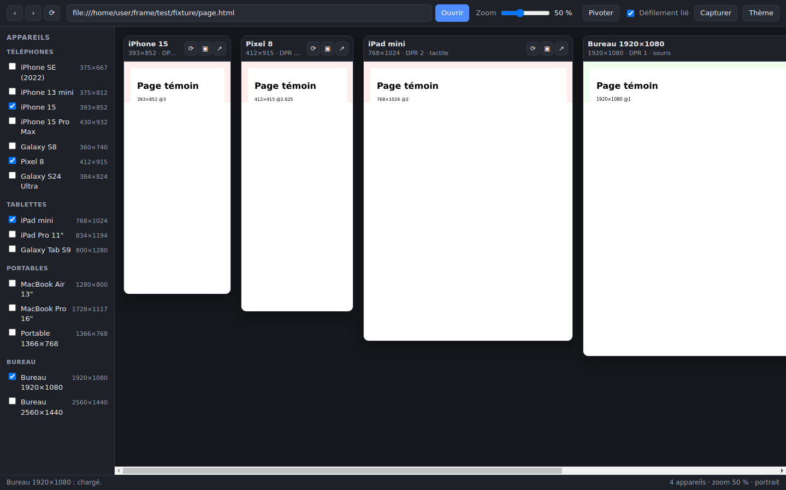

# Frame

Application de bureau pour tester la **responsivité d'un site web sur plusieurs appareils en même temps** :
téléphones iPhone et Android, tablettes, portables et écrans de bureau, côte à côte dans une seule fenêtre.



## Pourquoi pas une simple page HTML avec des `<iframe>`

Deux raisons rendent l'approche iframe inexploitable pour ce besoin :

- beaucoup de sites envoient `X-Frame-Options` ou `Content-Security-Policy: frame-ancestors`, et refusent
  donc de s'afficher dans une iframe ;
- redimensionner une iframe ne change **pas** `devicePixelRatio`, ni `pointer: coarse`, ni le traitement de
  `<meta name="viewport">`. Les media queries répondent, mais le rendu n'est pas celui d'un mobile.

Frame utilise donc de vraies vues de navigateur (`<webview>` Electron) et pilote chacune par le
**protocole DevTools** (`Emulation.setDeviceMetricsOverride`), exactement comme le mode appareil de Chrome.
Chaque cadre a son propre viewport, son propre DPR, son propre user-agent et sa propre émulation tactile.

## Fonctionnalités

- **Catalogue d'appareils** : iPhone SE → 15 Pro Max, Pixel 8, Galaxy S8 / S24 Ultra, iPad mini / Pro,
  Galaxy Tab S9, MacBook Air / Pro, 1366×768, 1080p et 1440p.
- **Émulation réelle** : dimensions CSS, `devicePixelRatio`, `pointer: coarse`, événements tactiles,
  user-agent et orientation, appliqués **avant** l'exécution des scripts de la page.
- **Navigation synchronisée** : un clic sur un lien dans un appareil emmène tous les autres sur la même URL.
- **Défilement lié** (désactivable) entre tous les appareils.
- **Rotation** portrait / paysage des mobiles et tablettes.
- **Zoom d'affichage** de 20 % à 100 % pour tout garder à l'écran.
- **Captures PNG pleine page**, pour un appareil ou pour tous d'un coup.
- Thème clair / sombre, sélection d'appareils, URL et zoom **conservés d'une session à l'autre**.

## Installation

Téléchargez le paquet correspondant à votre système depuis la page
[Releases](https://github.com/shellie2003/frame/releases) :

| Système | Fichiers |
| --- | --- |
| Linux | `Frame-x.y.z.AppImage`, `frame_x.y.z_amd64.deb` |
| Windows | `Frame Setup x.y.z.exe`, version portable |
| macOS | `Frame-x.y.z.dmg`, `.zip` |

Les paquets ne sont pas signés : macOS et Windows afficheront un avertissement au premier lancement.

## Développement

Node 22 ou plus récent (le lanceur de tests intégré n'étend les motifs glob qu'à partir de cette version).

```bash
npm install
npm start                       # build + lancement
npm run watch                   # reconstruction continue (dans un second terminal : npx electron .)
npm run typecheck               # TypeScript strict
npm test                        # tests unitaires du catalogue et de la normalisation d'URL
npm run smoke                   # lance l'app et vérifie l'émulation réelle de chaque appareil
npm run dist                    # paquets pour le système courant
```

Une URL peut être passée en argument : `npx electron . https://mon-site.local:3000`.

### Raccourcis

| Raccourci | Action |
| --- | --- |
| `Ctrl/Cmd + R` | Recharger tous les appareils |
| `Ctrl/Cmd + Alt + R` | Pivoter |
| `Ctrl/Cmd + Maj + S` | Capturer tous les appareils |
| `Ctrl/Cmd + +` / `-` / `0` | Zoom |
| `Ctrl/Cmd + Maj + T` | Thème clair / sombre |

### Architecture

```
src/
  shared/devices.ts    catalogue d'appareils et normalisation d'URL (partagé, testé)
  main/                processus principal Electron
    main.ts            fenêtre, menu, IPC
    emulation.ts       overrides DevTools (métriques, tactile, user-agent) et captures
    cli.ts             arguments de ligne de commande
    smoke.ts           vérification automatisée lancée par --smoke
    store.ts           préférences persistées
  preload/host.ts      pont contextIsolation entre le renderer et le processus principal
  preload/guest.ts     remontée du défilement depuis chaque page testée
  renderer/            interface (cadres, catalogue, barre d'outils)
```

Les sites testés tournent dans une session Electron dédiée (`persist:frame-guests`) où **toutes les
permissions sont refusées** (caméra, micro, géolocalisation, notifications) et où l'ouverture de fenêtre
est renvoyée vers le navigateur système.

## Ajouter un appareil

Une entrée dans `DEVICES` (`src/shared/devices.ts`) suffit ; l'interface et les tests s'y adaptent seuls :

```ts
{ id: 'nothing-phone-2', name: 'Nothing Phone (2)', category: 'phone', platform: 'android',
  width: 412, height: 915, dpr: 2.6, touch: true, userAgent: UA_ANDROID_PHONE },
```

## Intégration continue

- **`.github/workflows/ci.yml`** — à chaque push et pull request : typecheck, tests unitaires, build, puis
  smoke test qui lance réellement l'application sous Xvfb et vérifie que chaque vue est émulée aux bonnes
  dimensions. Ensuite, packaging Linux / Windows / macOS en parallèle, déposé en artefacts.
- **`.github/workflows/release.yml`** — sur un tag `v*` : construit les trois plateformes et attache les
  paquets à une release GitHub en brouillon.

## Licence

MIT
